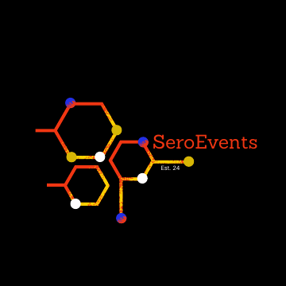

# Seroevents Website & Event Platform
## Development Proposal

### 1. Project goal

Transform the current Seroevents website into a professional, easy-to-use platform where visitors discover scientific events, attendees register and access agendas, and the team manages content through an admin dashboard.

Social sharing will be a central part of the attendee experience, helping participants promote events through branded announcement cards and LinkedIn.

### 2. Current gaps and proposed improvements

| Current website | Proposed improvement |
|---|---|
| Content and event details require code changes | Admin dashboard for managing pages, events, photos and agendas |
| Enquiries and registration depend on email links | Website enquiry forms and recorded event registrations |
| No attendee accounts or personal history | Secure accounts with registered events and agenda-download history |
| Gallery and event sections are incomplete | Redesigned upcoming/past event listings and photo albums |
| No personal invitations or sharing cards | Private QR invitations and separate public announcement cards |
| No attendee activity reporting | Searchable activity records showing who performed each agreed action and when |

### 3. What we will deliver

**A redesigned website**

- Clear, responsive layouts for desktop and mobile.
- Updated presentation of company information, services and partnerships.
- Upcoming and previous event listings.
- Event pages with a main banner, event details, programme, speakers and photo album.

**Domain email setup**

- Set up leadership mailboxes on `rcmleadership.ae`: Dr.Shireen, Dr.alaa and Abdulkarim.
- Set up `info@seroevents.com` and `contact@seroevents.com` as agreed mailboxes or shared inboxes.
- Configure domain email records and test sending and receiving.
- Configure automated application emails for password recovery, registration confirmations and invitations.
- Confirm UAE mailbox storage with the selected provider.

**Attendee accounts and registration**

- Self-hosted sign-up and login with securely hashed passwords and password recovery.
- Event registration with email confirmation.
- Personal account area showing registered events and downloaded agendas.
- Agenda downloads for all signed-in users.
- Website enquiry forms with stored submissions for the team to manage.

**Invitations and social sharing**

- Private event invitation containing event information, a unique serial and QR code.
- QR validation for admission, with repeat entry recorded.
- Branded “I’m attending” announcement card with the event name, date, location and subject.
- Downloadable card, prepared caption and hashtags, and a final “Share on LinkedIn” button.
- Official Seroevents LinkedIn reference in the prepared content; the attendee completes posting and any platform mention selection on LinkedIn.

**Admin dashboard and database**

- Admin-only access, enforced by the application.
- Add and edit website content, events, speakers, programmes, photos and agendas.
- View registrations, enquiries and attendee activity.
- Archive content through a simple soft-delete action.
- Structured database connecting users, events, registrations, documents and activity records.

### 4. Agreed operating rules

| Item | Launch behaviour |
|---|---|
| Registration approval | **Automatic approval.** No manual approval step at launch. |
| Event admission | **Re-entry allowed.** A valid QR pass can be scanned again, with each admission recorded. |
| Agenda access | All signed-in users can download agendas; event registration is not required. |
| Admin deletion | Archive/soft delete only; preserve historical records. |
| LinkedIn activity | Clicking the final button that redirects to LinkedIn completes the logged sharing action. |
| Public/private cards | Public announcement cards never contain the private admission QR credential. |

### 5. Activity records

The activity report will record these five actions with the user, date/time and relevant event or agenda:

1. Login.
2. Logout.
3. Event registration.
4. Agenda download.
5. Final “Share on LinkedIn” button click.

Log retention duration will be agreed before launch. Actual publication on LinkedIn does not need to be verified.

### 6. Domain email and UAE hosting

**Business email setup**

| Domain | Initial addresses |
|---|---|
| rcmleadership.ae | Dr.Shireen@rcmleadership.ae; Dr.alaa@rcmleadership.ae; Abdulkarim@rcmleadership.ae |
| seroevents.com | info@seroevents.com; contact@seroevents.com |

Mailbox options: **Microsoft Exchange Online** with UAE mailbox placement, **AEserver UAE email**, or **Zoho Mail subject to confirmation of UAE Mail availability and storage**.

Recommended starting arrangement: three personal leadership mailboxes and shared info/contact inboxes, with automated application email handled separately.

**Application hosting**

Hosting options: **Oracle Cloud Dubai**, **AEserver Dubai VPS**, or **Microsoft Azure UAE North (Dubai)**.

Initial sizing: approximately **4 vCPU, 8 GB RAM and 100 GB SSD**, validated before launch. Keep application data, files and backups in the UAE. Final provider selection will confirm location, backup arrangements and support. Mailbox storage location is checked separately from website hosting.

### 7. Delivery approach

| Stage | Reviewable outcome |
|---|---|
| 1. Design | Page structure and proposed visual designs for public, attendee and admin journeys |
| 2. Foundation | Database, authentication, access permissions and admin in the content management |
| 3. Features | Registrations, agendas, account history, email, cards, QR admission and activity reporting |
| 4. Launch | Tested mobile/desktop journeys, deployment, admin guidance and handover |

The delivery schedule will be agreed after confirming content readiness and the design direction.

### 8. Completion checks

- An admin can publish an event, upload its photos and agenda, and later archive it.
- An attendee can create an account, register and receive confirmation and a private invitation.
- A signed-in user can download an agenda and see it in their history.
- A registered attendee can generate a public card and open LinkedIn sharing.
- A valid invitation supports initial entry and re-entry; invalid or revoked passes are rejected.
- The five agreed activity types appear in the admin report.
- Attendees cannot access the CMS or another attendee’s private records.

### 9. Client inputs and scope boundaries

Please provide approved logos, event details, photographs, speaker information, agendas, domain/DNS access and the official LinkedIn page URL. Confirm the final mailbox spellings and who will handle shared inboxes.

Payments, certificates and subscriptions are **not included**. Social posting is completed by the attendee on LinkedIn; automatic posting is not required. Log retention remains to be agreed.
